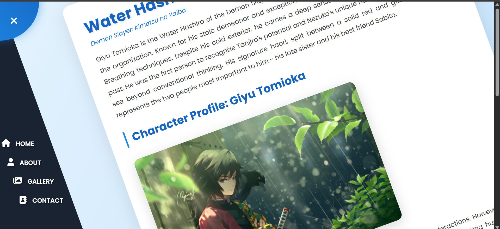
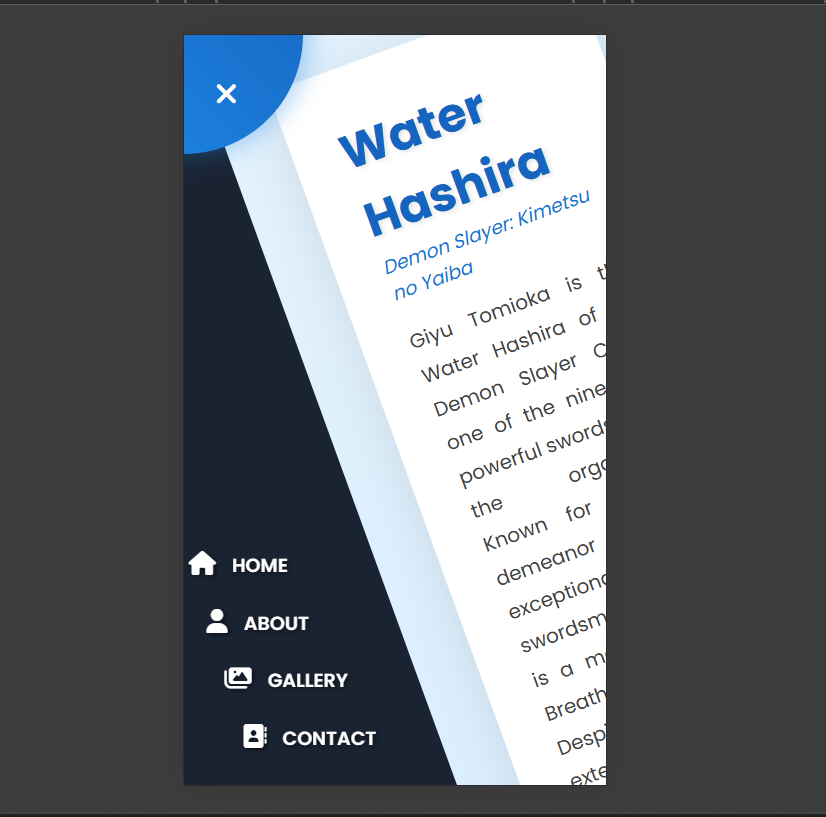

# 🌊 Water Hashira - Rotating Navigation


> **Day 3 of 50** - 50 Days 50 JavaScript Projects Challenge

A beautiful rotating navigation menu tribute page for Giyu Tomioka, the Water Hashira from Demon Slayer. Features smooth CSS transitions and an interactive circular navigation that rotates the entire page!

## ✨ Features

- 🔄 Unique rotating page animation
- 🎨 Water-themed gradient design
- 📱 Fully responsive layout
- ⚡ Smooth CSS transitions
- 🎯 Clean and modern UI
<p align="center">
  
</p>
<p align="center">
  
</p>

## 🛠️ Tech Stack


## 🚀 Demo

[Live Demo](https://yourusername.github.io/water-hashira-rotating-nav/)

## 📸 Image Credits

Character artwork from [Alphacoders](https://alphacoders.com/)

**Note:** Fan project for educational purposes only. No copyright infringement intended.

## 💡 Key Learnings

- CSS Transform & Transform-Origin
- Smooth transitions and animations
- Fixed positioning and layering
- Event listeners in JavaScript
- Responsive design principles

## 🎯 Challenge Progress

This is **Project #3** of my **50 Days 50 JavaScript Projects** challenge where I build 50 small projects to master JavaScript fundamentals and DOM manipulation.

 [Previous Project]( https://vighnesh204.github.io/interior-design-gallery/) 

## 📦 Installation

```bash
# Clone the repository
git clone https://github.com/vighnesh204/rotating-nav.git

# Navigate to project directory
cd rotating-nav

# Open index.html in your browser
open index.html
```

## 🤝 Contributing

Feel free to fork this project and add your own improvements! Suggestions and feedback are always welcome.


---


**Made with 💙 by [Vighnesh Borhade]**

*Part of #50Days50Projects Challenge*


